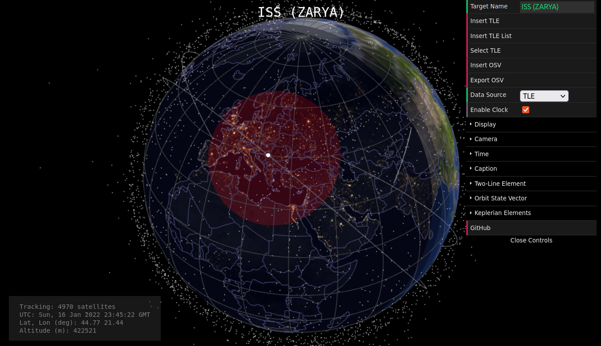

# OrbitsGL
Visualization of elliptic orbits with WebGL.

Simple 3d visualization implemented with WebGL of elliptical orbits of satellites. The computation is based on my earlier project [ISSLive_Sun](https://github.com/vsr83/ISSLive_Sun).

The ground track is obtained from the latest Orbit State Vectors (OSV) by computation of the osculating Keplerian elements and then propagating the track assuming an ideal Kepler orbit. The obtained positions in the J2000 frame are then transformed to ECEF frame taking into account axial precession and nutation.

From comparisons to Astropy calculations and online visualizations, it seems that the computation is able to reach an accuracy around 0.1 degrees (or 10 km) when recent OSV is available. However, the accuracy will degrade quickly when the delay from last received OSV increases.

By default, the visualization depicts the orbit of the ISS using the ISSLive Lightstreamer feed. Since the Lightstreamer feed seems to be occasionally unreliable, the position data can be obtained from the [Orbit Ephemeris Message](https://spotthestation.nasa.gov/trajectory_data.cfm). Note that the OEM in the repository will get obsolete, if not manually updated to the repository. It is also possible to initialize the OSV manually with strings obtained from trajectory data. The feature can be used to visualize arbitrary satellites on elliptical orbits as long as OSV is available. 

Click below to execute in browser.

